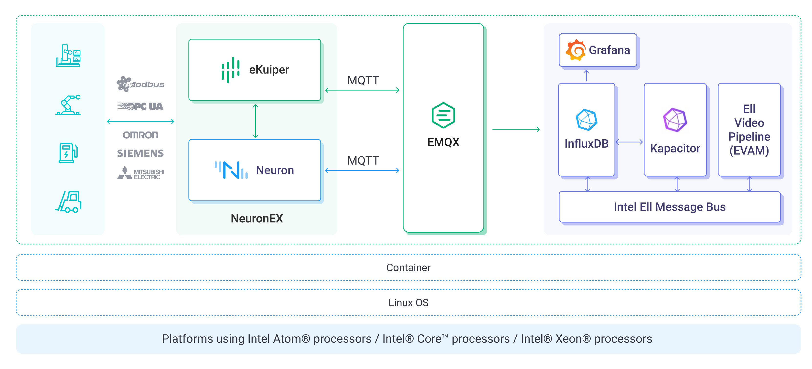

## Overview

In the era of industrial digitization, the global manufacturing industry is experiencing significant changes, and China, as a major manufacturing country, is actively promoting the transformation from "Made in China" to "Made in China". The realization of industrial digitization and intelligence requires data as the core driving force, however, many industrial enterprises are facing a series of data challenges such as data silos, data latency, complicated protocols, equipment heterogeneity and heavy operation and maintenance work.
Based on this background, Intel and EMQ are working together to launch a joint industrial solution. Integrating EMQ's cloud-side collaboration data foundation software and Intel's data processing, management and visualization tools, the solution helps industrial enterprises realize the integrated collection, connection, movement, processing, storage, analysis and display of the whole process of data processing. For enterprises to solve all kinds of data problems encountered in industrial digital transformation. At present, the joint solution has been applied to some head customers in the smart factory, energy and other industries, and has been recognized by customers, hoping that it will become the cornerstone of intelligent transformation of smart factories, energy and power, petroleum and petrochemical, iron and steel metallurgy and other major scenarios in the future.

## Industrial Joint Solution of Intel and EMQ

## Program Architecture
Intel and EMQ jointly build an industrial IoT data base, with two EMQ products: EMQX, an MQTT message server in the cloud, and NeuronEX (Neuron + eKuiper), a software for device data collection and edge intelligence analysis, which solves the problem of collecting, connecting, pre-processing, and aggregating industrial data from the edge to the cloud. Intel®Edge Insights for Industrial provides database, video, image, and time-series data processing and analytics tools to address the storage, analysis, and presentation needs after data collection.
Through this joint solution, we enable a clear flow of data from the IoT device to the edge and ultimately to the cloud, providing industrial organizations with powerful, secure and scalable data processing and analysis capabilities.

## EMQ Products
- **NeuronEX** is an industrial edge gateway software that provides device data collection and edge intelligence analysis services. It is mainly deployed in industrial sites to realize the functions of industrial equipment communication and industrial bus protocol acquisition, industrial system data integration, edge-end data filtering and analysis and AI algorithm integration, as well as industrial Internet platform docking and integration. It provides low-latency data access management and intelligent analysis services for industrial scenarios, helping users gain quick insights into business trends and improve operational efficiency and sustainability.

- **EMQX Enterprise** is a large-scale, distributed IoT data access platform. As a high-performance, scalable MQTT messaging server, it provides reliable real-time messaging and device connectivity solutions for Internet of Things (IoT) applications. With a powerful built-in rules engine and data integration capabilities, EMQX can perform real-time data processing, data transformation, and routing of massive IoT data, as well as seamlessly integrate IoT data into a variety of back-end databases and analytics tools, helping organizations rapidly build business-critical IoT platforms and applications.
## Intel Products

- Intel® Edge Insight Platform

Intel® Edge Insights for Industrial (Intel®Edge Insights Platform) is a software framework based on modular design, microservice architecture, and containerized deployment. It enables edge-side data connectivity, data analytics, and edge-cloud collaboration. It supports video, image, and time-series data, and provides basic functional modules for extraction, storage, analysis and reasoning, and visualization, and each module communicates with each other through a data bus.EII supports common protocols such as OPCUA, MQTT, ZMQ, Restful, etc., and also flexibly supports the user to access the customized protocols and upper-layer applications. 
EII integrates Intel®OpenVINO™, a suite of tools optimized for deep learning. Users can call CVOI and AI reference algorithms optimized for X86 platforms, load third-party algorithms, and flexibly utilize tools such as Intel®OpenVINO™, Intel®oneAPI, Intel® Deep Learning Streamer, etc. for better and faster performance. Streamer and other tools for better and faster development and deployment of solutions. eii provides an optimized framework to support multiple applications and use cases at the edge, enabling higher performance of Intel® architecture-optimized AI reasoning.

- **Intel® Processors**

The 12th generation Intel® Core™ desktop processor with high-performance hybrid architecture represents a major leap in Intel® Core™ processor architecture and performance over the years, delivering up to 1.36x single-threaded and 1.35x multi-threaded performance improvements over the 10th generation Intel® Core™ processor. This revolutionary chip design integrates up to eight P-cores (performance cores) for enhanced IoT workload integration and eight E-cores (energy efficiency cores) for improved background task management and multitasking. The Intel® Hardware Thread Scheduler intelligently directs the operating system to assign the right workloads to the right cores. Processor base power ranges from 35W to 65W for balanced performance and efficiency. All IoT SKUs are backed by long term warranties and software support, enabling lasting returns on IT/OT investments. On the graphics side, the CPU design is based on the Intel® Ultra Core Graphics 770 powered by the Intel® Xe Architecture, which integrates up to 32 Graphics Execution Units (EUs), delivering up to a 1.94x performance increase in graphics performance over the 10th generation Intel® Core™ processors. The 12th Gen Intel® Core™ desktop processor delivers a 2.81x increase in GPU image classification and inference performance to meet the growing demand for AI across a wide range of industries and use cases. The high-performance graphics architecture is fully adapted to AI workloads, supporting greater parallel processing with fast, efficient inference, and AI builders can leverage Intel® Deep Learning Boost for hardware-based AI acceleration, while optimizing inference with the Intel® release OpenVINO™ tool suite.