# **Calculating Data Rate for EII Timeseries Benchmarking Scenarios with EMQ** 

## Machine configuration

### Aliyun ECS
**CPU and Memory**: Intel(R) Xeon(R) Platinum 8475B 4vCPU(s) 16 GiB

**Operating System**: Ubuntu 22.04 64 bit

**Disk**: ESSD PL0 100GiB (3000 IOPS)

Type:ecs.g8i.xlarge (Aliyun)

### CST U11TK-BX268B

**CPU and Memory**: Intel Core I7-1165G7 8vCPU(s) 16 GiB

**Operating System**: Ubuntu 22.04 64 bit

**Disk**: 256GB SSD

### CST U12TK-BA1

**CPU and Memory**: Intel Core I7-1255U 12vCPU(s) 16 GiB

**Operating System**: Ubuntu 22.04 64 bit

**Disk**: 256GB SSD

## TimeSeries with EMQ Benefits

**Neuron**: It can provide EII with a variety of industrial protocol data acquisition, such as Modbus, OPCUA, Ethernet/IP, IEC104, BACnet, Siemens, Mitsubishi and so on.

**EMQX**: It can provide EII with integrated distributed MQTT messaging services and a powerful Io-T rules engine to power highly reliable, high-performance IoT real time data movement, processing and integration. Supports MQTT, HTTP, QUIC, WebSocket, LwM2M/CoAP or proprietary protocols to connect any device.

## TimeSeries Benchmarking

In the time series benchmark testing, a Modbus simulator is installed on the node and different amounts of point data are collected via Neuron and written to the InfluxDB time series database using the rule engine after being sent to EMQX in JSON data format via MQTT. During testing, CPU, memory, and EMQX rule engine message throughput, write rate, and data loss in the data repository are monitored to determine the maximum throughput and to conclude the point of system overload.

### Time-Series Use Cases ---- Industrial data
In this test case, we run multiple southbound devices on the Neuron to collect Modbus simulator data, and then use EMQX to convert the collected data into time series data that is eventually written to InfluxDB.

Industrial data is tested with three use cases
1. Ingest+ store (datastore)Only.
2. Ingest + Analytics with store (datastore)
3. Ingest + MQTT data store (datastore)
4. Ingest + Analytics with MQTT data store (datastore)

## Ingest+ Store (datastore) Only Scenario

### EII Node:

I.Prepare the time_series.yml with below required containers:

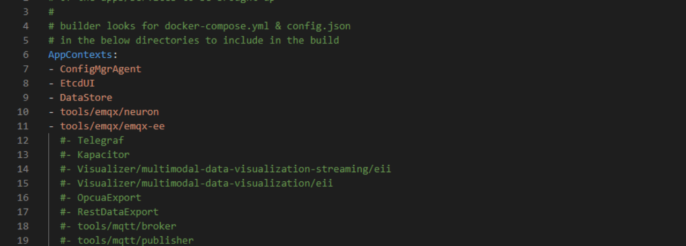

II.Run the builder: 

~~~shell
python3 builder.py -f usecases/time-series.yml
~~~

III.Run the container

~~~shell
docker-compose build && docker-compose up -d
~~~

IV.Creating EMQX Rule Engine Rule Data Persistence to InfluxDB.

### Modbus node:

I.Preparing Modbus Simulator Runnables, Neuron Modbus Data Acquisition Configuration Scripts.Download resources from this [url](https://47.111.177.175:8080/files/benchmark/code/).Username: **`emqx`**,Password: **`emqxa303.`**

II.unzip modbus.zip and run the executables to run the Modbus simulator.

III.Configure neuron.py to create configurations with different numbers of driver points to collect Modbus simulator data.

- 5k points, acquisition frequency 1s (10 southbound Modbus drivers, 10 groups per southbound driver, 50 tags per group; 10 northbound MQTT drivers are used for data reporting to EMQX)

- 50k points, acquisition frequency 1s (10 southbound Modbus drivers, 50 groups per southbound driver, 100 tags per group; 10 northbound MQTT drivers for data reporting to EMQX)

- 100k points, acquisition frequency 1s (10 southbound Modbus drivers, 100 groups per southbound driver, 100 tags per group; 10 northbound MQTT drivers for data reporting to EMQX)

## Ingest+ Analytics with store (datastore) Scenario

### EII node:

I.Prepare the time_series.yml with below required containers:

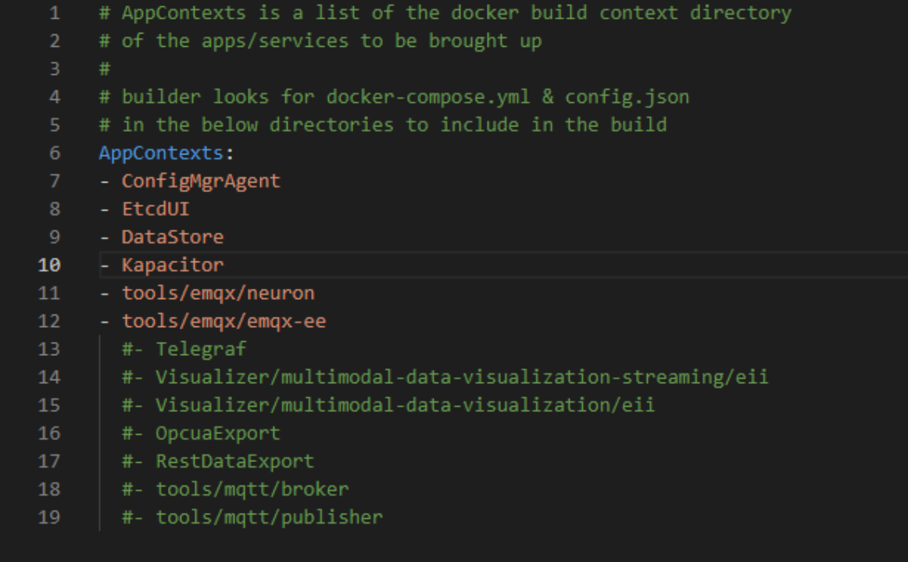

II.Kapacitor Configs:
~~~shell
vim ./IEdgeInsights/Kapacitor/config/kapacitor.conf
~~~

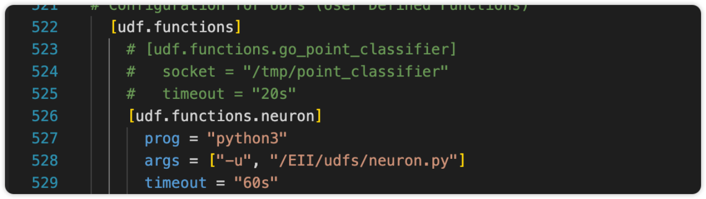

III.Add the rfc tick script with below config:

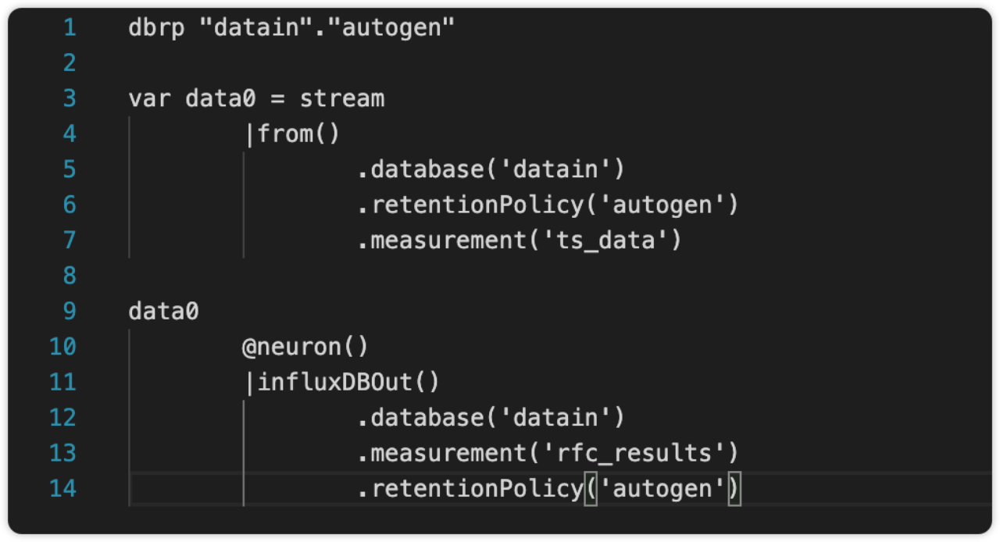

IV.Run the builder: 

~~~shell
python3 builder.py -f usecases/time-series.yml
~~~

V.Run the container

~~~shell
docker-compose build && docker-compose up -d
~~~

### Modbus node:

I.Preparing Modbus Simulator Runnables, Neuron Modbus Data Acquisition Configuration Scripts.Download resources from this [url](https://47.111.177.175:8080/files/benchmark/code/).Username: **`emqx`**,Password: **`emqxa303.`**

II.unzip modbus.zip and run the executables to run the Modbus simulator.

III.Configure neuron.py to create configurations with different numbers of driver points to collect Modbus simulator data.

- 5k points, acquisition frequency 1s (10 southbound Modbus drivers, 10 groups per southbound driver, 50 tags per group; 10 northbound MQTT drivers are used for data reporting to EMQX)

- 50k points, acquisition frequency 1s (10 southbound Modbus drivers, 50 groups per southbound driver, 100 tags per group; 10 northbound MQTT drivers for data reporting to EMQX)

- 100k points, acquisition frequency 1s (10 southbound Modbus drivers, 100 groups per southbound driver, 100 tags per group; 10 northbound MQTT drivers for data reporting to EMQX)

## Ingest+ MQTT Data Store (datastore) Only Scenario 

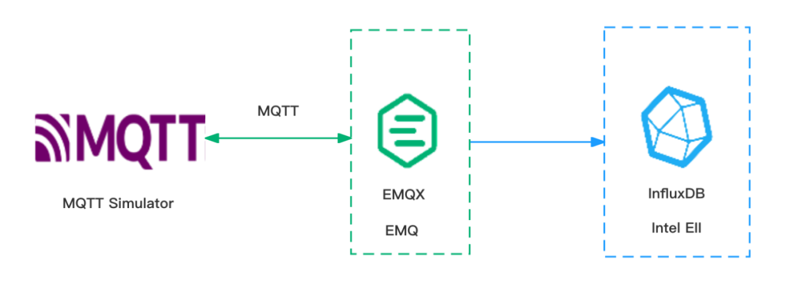

### EII Node:

I.Prepare the time_series.yml with below required containers:

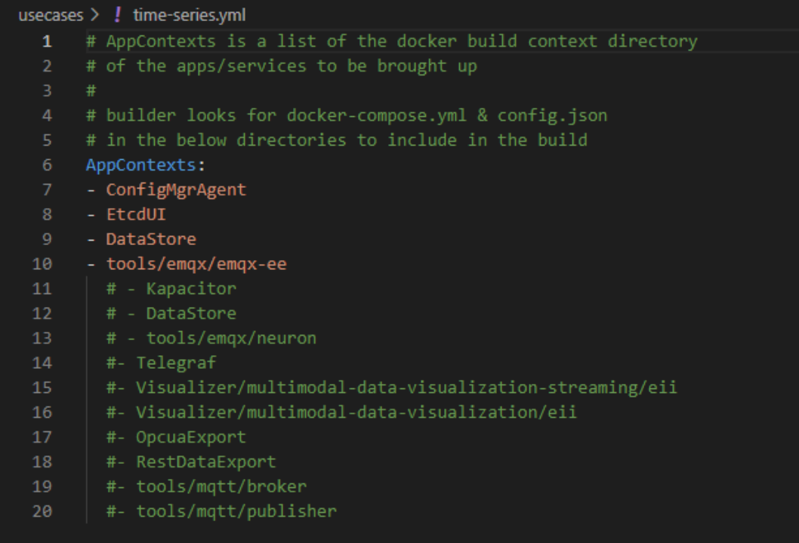

II.Run the builder: 

~~~shell
python3 builder.py -f usecases/time-series.yml
~~~

III.Run the container

~~~shell
docker-compose build && docker-compose up -d
~~~

IV.Creating EMQX Rule Engine Rule Data Persistence to InfluxDB.

### MQTT Simulation node:

I.Prepare the MQTT benchmark tool eMQTT-Bench.We can donwload in this page. 

https://www.emqx.com/zh/downloads/emqtt-bench/0.4.15

II.Decompress the eMQTT-Bench compressed package and run the benchmark command to send MQTT data to EMQX.

## Ingest+ Analytics with MQTT Data store (datastore) Scenario

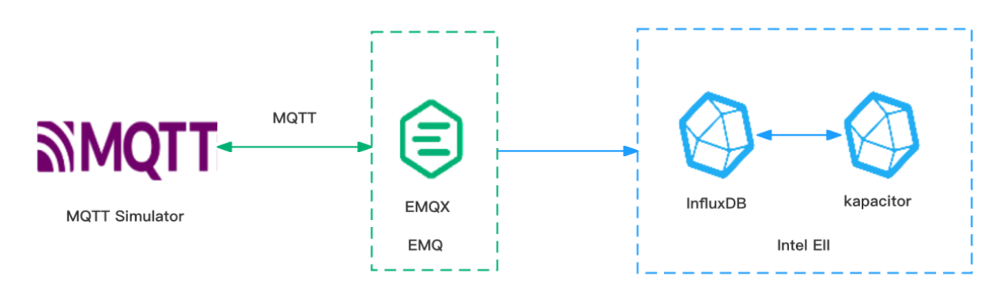

### EII node:

I.Prepare the time_series.yml with below required containers:

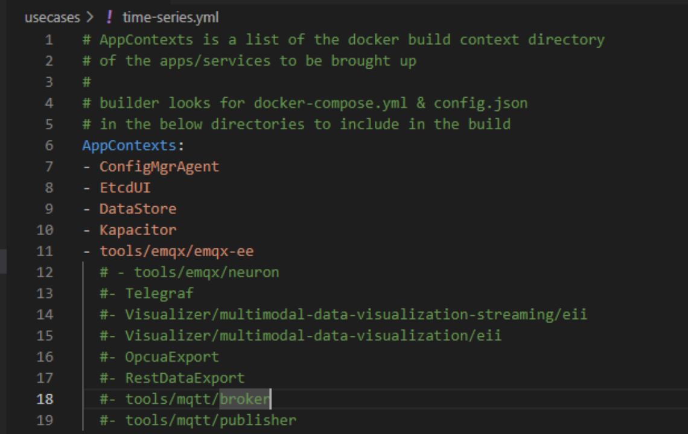

II.Kapacitor Configs:

~~~shell
vim ./IEdgeInsights/Kapacitor/config/kapacitor.conf
~~~

III.Add the rfc tick script with below config:

IV.Run the builder: 

~~~shell
python3 builder.py -f usecases/time-series.yml
~~~

V.Run the container

~~~shell
docker-compose build && docker-compose up -d
~~~

### MQTT Simulation node:

I.Prepare the MQTT benchmark tool eMQTT-Bench.We can donwload in this page. 

https://www.emqx.com/zh/downloads/emqtt-bench/0.4.15

II.Decompress the eMQTT-Bench compressed package and run the benchmark command to send MQTT data to EMQX.

## Conclusion

### Field description

**Number of Points**:The total number of Modbus points collected by Neuron.

**Message Rate**:Message rate per second.

**Message Size**:Size of each message.

**MQTT Client Count**:The number of MQTT connected to EMQX.

**MQTT Message Rate**:The total number of messages sent per second by the MQTT client connected to EMQX.

**MQTT Message Size**:Message size of each MQTT message

### Ingest+ Without Store Scenario

### Intel(R) Xeon(R) Platinum 8475B

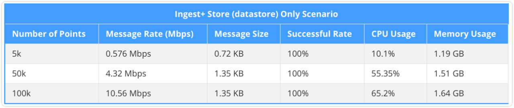

### Intel Core I7-1165G7

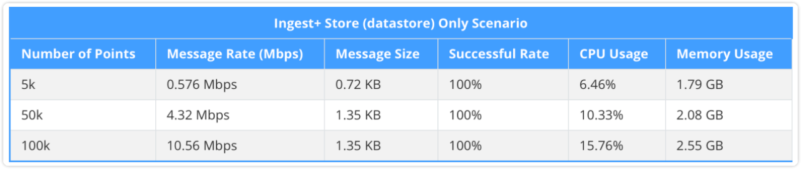

### Intel Core I7-1255U

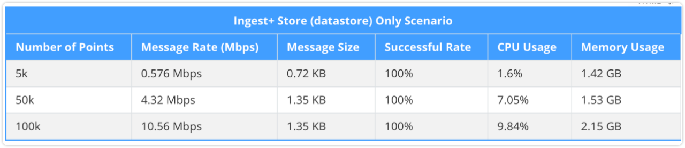

Neuron and EMQX are based on Intel EII, three test cases: 5k(100msg/s), 50k(500msg/s), and 100k(1000msg/s) modbus points were captured, and the EMQX rule engine write data to the InfluxDB database at 100, 500, and 1k TPS per second, respectively. CPU and memory usage was normal during the test. It can be seen that Intel Core I7-1255U generation CPU has the best performance.

### Ingest+ Analytics with store (datastore) Scenario

### Intel(R) Xeon(R) Platinum 8475B

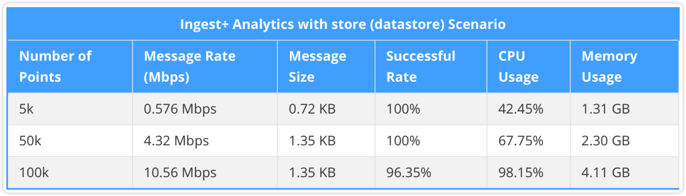

### Intel Core I7-1165G7

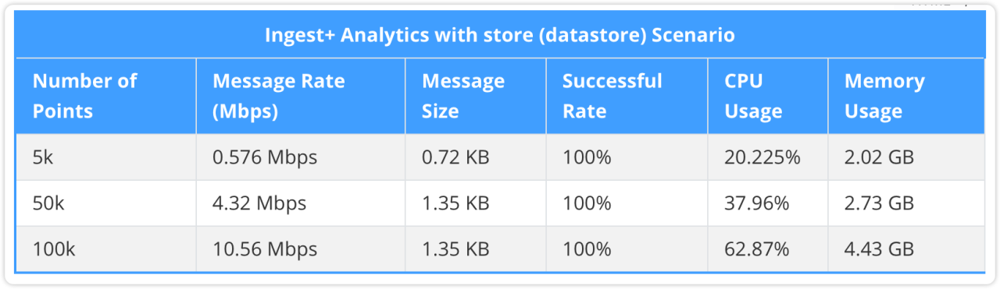

### Intel Core I7-1255U

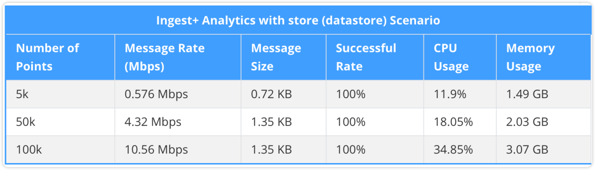

Neuron and EMQX are based on Intel EII and Kapacitor for data analysis with three test cases: 5k (100msg/s), 50k (500msg/s), and 100k (1000msg/s) modbus points. the EMQX rule engine writes data into the InfluxDB database and re-writes the data into a new InfluxDB measurement after Kapacitor analysis. The EMQX rule engine writes the data to the InfluxDB database at 100, 500, and 1k TPS, respectively, and rewrites the data to a new InfluxDB measurement after Kapacitor analysis. There is a write failure in Aliyun ECS here. The reason is that the influxdb write times out and the machine performance reaches the limit.

### Ingest+ MQTT data store (datastore) Scenario

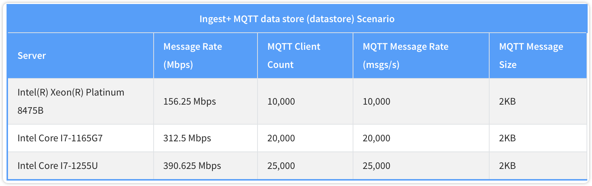

MQTT data is written to influxdb through EMQX, and the highest rates on different machines are 156.25 Mbps, 312.5 Mbps, and 390.625 Mbps respectively. CPU and memory usage reached their limits during the test. 

### Ingest+ analysis with MQTT data store (datastore) Scenario

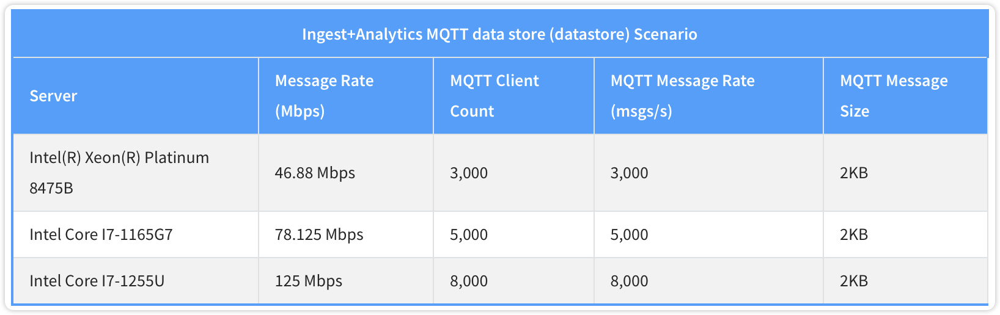

MQTT data is written to influxdb through EMQX, and the highest rates on different machines are 46.88Mbps, 78.125Mbps and 125Mbps respectively. After adding Kapacitor, the system resource consumption increased significantly, and the CPU and memory usage reached their limits during the test. 

From the above tests, it can be concluded that Neuron and EMQX software with Intel EII offer excellent performance and high reliability, making them ideal for handling edge timing scenarios. The efficient performance and stable and reliable features of these two software models ensure stable operation while processing large amounts of real-time data streams, meeting the stringent requirements for high efficiency and reliability in edge computing environments. 132